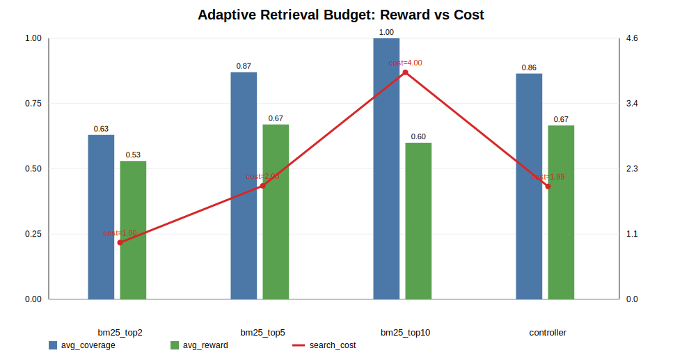

# Ophthalmology RAG Evaluation Case Study

本项目是一个面向眼科 AI 文献场景的 RAG evaluation case study。重点不是搭建生产级医学问答系统，而是验证医学文献 RAG 在 evidence retrieval、source grounding、generation coverage、rerank cost 和 failure analysis 上的评测闭环。

本项目不用于临床诊断或临床决策。

## 30-Second Summary

| Area | Key Result |
| --- | --- |
| Project focus | 垂类医学文献 RAG 的 source-level evaluation 与 ablation study |
| Core evaluation | source-level golden labels，避免 chunk-id 随切分策略漂移 |
| Retrieval | Dense 在跨语言医学 hard set 上最佳：source_hit@5 = 1.0000，source_mrr@5 = 0.7917 |
| Generation | dense_top10 达到最高 source_coverage@k = 0.6833 |
| Rerank | dense50_llm_top10 将 source_mrr@10 提升到 0.9583，但延迟约 36.26s/query |
| Caption pilot | Failure-case driven extension：针对图表信息缺失问题，将 vision-caption 作为补充 evidence source，在 5 条 hard pilot 中验证其可召回性，source recall 达到 100% |
| Adaptive retrieval appendix | BM25 budget oracle 出现 top2/top5/top10 tradeoff；v1 controller 接近但未超过 strongest fixed policy |

完整实验文件见 [Documentation Index](docs/README.md)。

## Visual Overview

## What This Project Demonstrates

1. 为垂直医学文献 RAG 构建 source-level evaluation，而不是只看 answer fluency。
2. 用 retrieval、generation、rerank 和 caption augmentation ablation 定位 evidence bottleneck。
3. 主动记录 retrieval miss、Hybrid 噪声、rerank latency、caption 误读和 LLM refine 429 等 badcases。

## Core Results

### Retrieval

该图展示 Dense / Hybrid / Sparse 检索在 source_hit@5、source_mrr@5 和 latency 上的对比。

Dense retrieval 是当前跨语言医学 hard set 上最稳定的 baseline：

- dense: source_hit@5 = 1.0000, source_mrr@5 = 0.7917
- hybrid: source_hit@5 = 0.9167, source_mrr@5 = 0.7667
- sparse: source_hit@5 = 0.8333, source_mrr@5 = 0.6944

简单 Hybrid RRF 没有带来提升，反而引入噪声和额外延迟。

Details: [Retrieval Ablation Summary](eval/results/retrieval_ablation_summary.md)

### Generation

该图展示不同 generation setting 在 source_hit@k、source_coverage@k、citation_coverage 和 latency 上的对比。

| setting | source_hit@k | source_coverage@k | citation_coverage |
| --- | ---: | ---: | ---: |
| dense_top5 | 0.8333 | 0.4889 | 0.4556 |
| dense_top8 | 1.0000 | 0.6417 | 0.6417 |
| dense_top10 | 1.0000 | 0.6833 | 0.6417 |
| hybrid_top10 | 1.0000 | 0.5861 | 0.5861 |

dense_top10 的 source_coverage@k 最高，为 0.6833。即使 retrieval hit 较高，generation 仍受 evidence coverage 限制。

Details: [Generation Ablation Summary](eval/results/generation_ablation_summary.md)

### Rerank

LLM rerank 能改善 evidence ranking，但成本很高：

- dense50_llm_top10 将 source_mrr@10 提升到 0.9583
- 平均延迟约 36.26s/query

因此 rerank 更适合作为离线 evidence utility rerank 或高风险 query 的可选策略，而不是默认在线检索路径。

Details: [Rerank Ablation Summary](eval/results/rerank_ablation_summary.md)

### Caption-Augmented RAG

图表增强部分是 failure-case driven extension，目标是分析纯文本 RAG 在 image/table evidence 上的召回缺口。

针对图表信息缺失问题，本项目将 vision-caption 作为补充 evidence source。在 5 条图表 hard pilot 中，caption-derived source recall 达到 100%，生成关键词覆盖从 3.40 提升到 5.80。该结果说明 caption 入库能补充部分图表相关 evidence retrieval，但仍需结合 answer-level factual correctness 进一步验证。

Details: [Caption-Augmented RAG](docs/showcase/caption_augmented_rag.md)

## Adaptive Retrieval Budget Appendix

这部分是实验性扩展，不是主项目结论，也不是正式 RL policy training 结果。它的作用是验证 retrieval budget 是否存在可学习的 cost-coverage tradeoff，为后续 RL Search Policy Controller 提供环境、action space 与 reward 设计依据。

该图展示 BM25 top2/top5/top10 与 rule controller v1 在 coverage、reward 和 search cost 上的对比。它说明 action space 有 tradeoff，但 controller v1 尚未超过 strongest fixed policy。

BM25 full-context oracle 分布：

- bm25_top5: 41/100
- bm25_top2: 33/100
- bm25_top10: 26/100

这说明 action space 存在真实 cost-coverage tradeoff。

v1 rule controller 结果：

- rule controller reward = 0.6660
- fixed bm25_top5 reward = 0.6700

结论：v1 controller 接近但没有超过 strongest fixed policy。因此这里不能声称 RL/controller 已经提升 retrieval performance。更准确的结论是 adaptive retrieval budget 有可学习信号，但当前 query/BM25 score 特征还不足以稳定预测 oracle action。

Details: [BM25 Budget Controller Summary](agentic_rl/results/bm25_budget_controller_summary.md)

## Boundary

本仓库是 portfolio case study，不是 production medical diagnosis system。

不包含原始 PDF、extracted paper images、vector databases、API keys 或完整 upstream runtime。

包含 evaluation design、scripts、result summaries、case studies、patches、figures 和 engineering notes。

## Next Steps

1. 扩充 hardcase source-level labels，并继续区分 retrieval miss、rerank failure 和 generation unsupported claim。
2. 将 `dense_top10`、`dense50_rerank10`、`multi_query_dense`、`multi_query_rerank` 和 `abstain` 抽象为 fixed search policies。
3. 在公开 multi-hop QA subset 上验证 `evidence_coverage - search_cost` reward 是否能区分 cheap search 与 expensive search。
4. 将 adaptive retrieval budget controller 保留为 appendix；只有在更大样本、更强 state features 和稳定 train/dev/test 结果下超过 fixed baseline 时，再升级为主实验结论。
5. 后续再评估是否迁移到 ophthalmology hard cases，作为医学 evidence search 的 domain transfer showcase。
