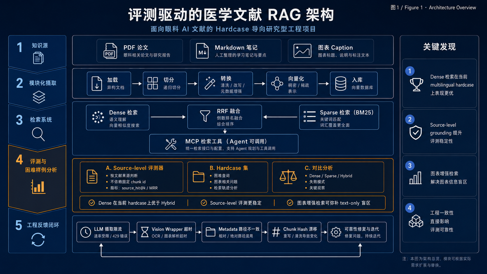
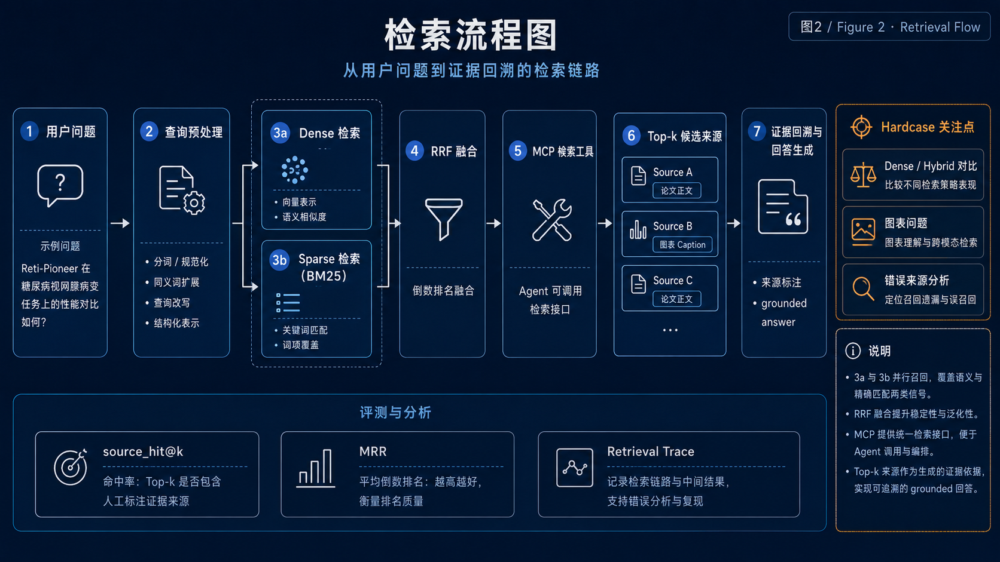
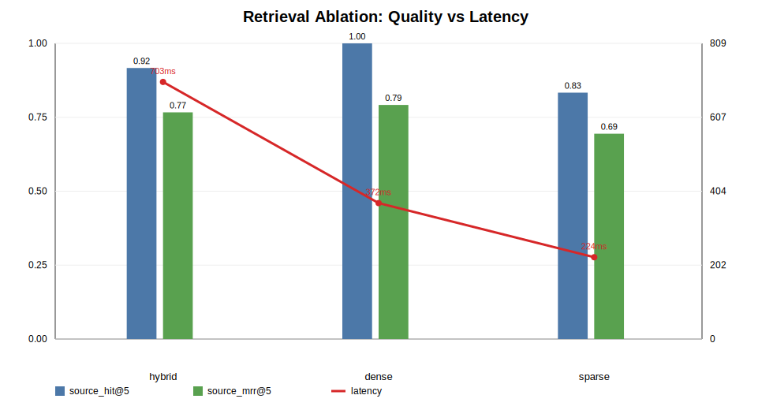
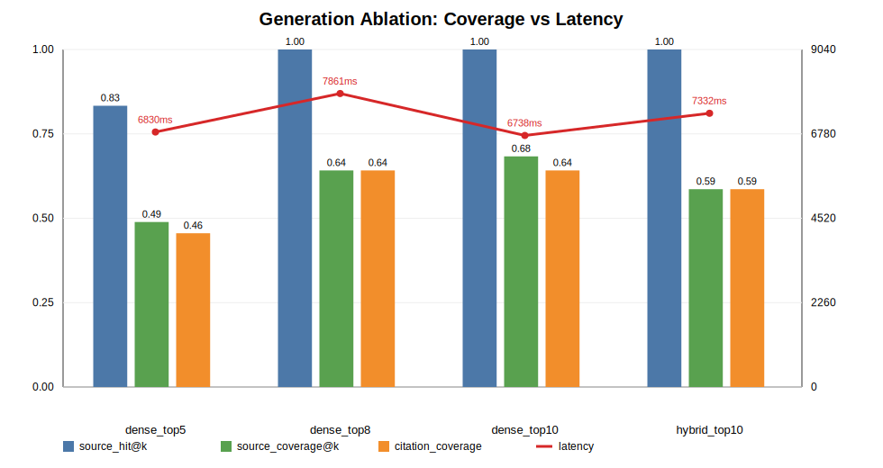
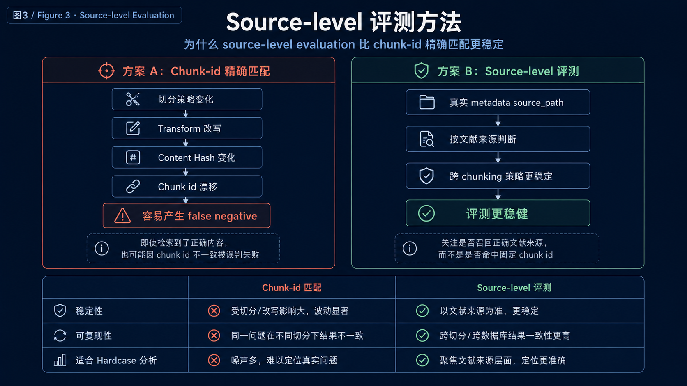
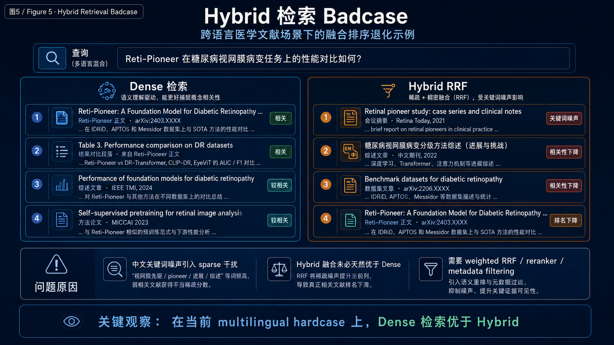
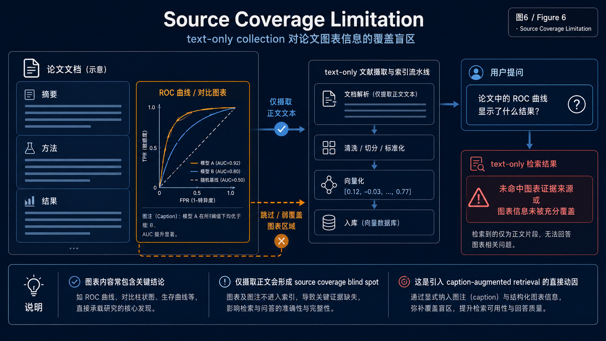

# Ophthalmology RAG Evaluation Case Study

> 本项目是基于 Modular RAG 框架完成的眼科 AI 文献 RAG 评测型 case study。
> 它不是生产级医学问答系统，也不用于临床诊断或临床决策。
> 项目重点是小规模眼科文献语料下的 source-level 评测设计、检索与生成消融实验、
> hardcase 分析、图表 caption 增强探索，以及工程 badcase 复盘。

本项目是一个面向眼科 AI 文献研究的 evaluation-driven RAG workflow，重点关注真实论文场景下的证据检索、回答质量评估、hardcase 分析与工程化复盘。

- 领域化 ingestion 与中文医学文本适配
- source-level golden set 设计
- Dense / Sparse / Hybrid 检索消融
- Vanilla LLM vs RAG generation 对比
- 成功案例、hard case 和工程 bad case 分析
- Vision caption / 图表增强 RAG 探索
- Markdown/TXT 派生知识源入库
- metadata-aware source evaluation
（持续进行）

> 本仓库不包含原始 PDF、向量数据库、API key 或上游完整源码，只保留评测设计、实验结果、脚本、patch 和案例分析。

## TL;DR

| Dimension | Result |
| --- | --- |
| Corpus | 10 篇眼科 AI 文献，英文论文 + 中文研究汇报 |
| Text chunks | 801 chunks，recursive splitter，补充中文分隔符 |
| Best retrieval baseline | `dense`：source_hit@5 = 1.0000，source_mrr@5 = 0.7917 |
| Best generation setting | `dense_top10`：source_coverage@k = 0.6833 |
| Hybrid finding | 跨语言医学检索里，简单 Hybrid RRF 不一定优于 Dense |
| Vision caption retrieval | hard set 上 source_hit_rate 从 0.0000 提升到 1.0000 |
| Vision caption generation | hard set 关键词覆盖从 3.40 提升到 5.80 |
| LLM ingestion finding | 长论文全量 chunk-level LLM refine 会触发大量 429，应改为 selective refinement |

## Visual Overview

> **PLACEHOLDER: Architecture Overview**  


> **PLACEHOLDER: Retrieval Flow**  


> **PLACEHOLDER: Caption-Augmented RAG Flow**  


## Project Navigation

### Core Story

- [Key Findings](docs/showcase/key_findings.md)
- [Evaluation Methodology](docs/showcase/evaluation_methodology.md)
- [Hardcase Examples](docs/showcase/hardcase_examples.md)
- [Engineering Notes & Badcases](docs/showcase/engineering_notes_badcases.md)
- [Caption-Augmented RAG](docs/showcase/caption_augmented_rag.md)
- [Interview Pitch](docs/records/interview_pitch.md)

### Detailed Case Studies

- [Overall Evaluation Summary](docs/records/ophthalmology_rag_eval_summary.md)
- [Success Case](docs/records/success_case.md)
- [Limitation Case](docs/records/limitation_case.md)
- [Original Error Analysis](docs/records/error_analysis.md)
- [Vision Caption Exploration](docs/records/vision_caption_exploration.md)

### Results

- [Retrieval Ablation](eval/results/retrieval_ablation_summary.md)
- [Generation Top-k Ablation](eval/results/generation_topk_ablation_summary.md)
- [Reti-Pioneer Figure Captions](eval/results/reti_pioneer_figure_captions.md)
- [Vision Caption Retrieval Comparison](eval/results/vision_caption_retrieval_summary.md)
- [Vision Caption Generation Comparison](eval/results/vision_caption_generation_summary.md)
- [Vision Caption Hard Retrieval Comparison](eval/results/vision_caption_hard_retrieval_summary.md)
- [Vision Caption Hard Generation Comparison](eval/results/vision_caption_hard_generation_summary.md)

### Patches

- [Source-level Evaluation](patches/source_level_evaluation.patch)
- [Chinese Recursive Splitter](patches/chinese_recursive_splitter.patch)
- [Logging Noise Suppression](patches/logging_noise_suppression.patch)
- [Vision LLM Base URL Fix](patches/vision_llm_base_url.patch)
- [Markdown/TXT Ingestion](patches/text_loader_markdown_ingestion.patch)

## What I Built

### 1. 眼科文献领域适配

我将通用 Modular RAG MCP Server 适配到眼科 AI 文献场景：

- 10 篇 PDF 文档
- 英文眼科 AI 论文 + 中文研究汇报
- 801 个 text chunks
- recursive splitter with Chinese punctuation separators
- source-level evaluation labels，不受 chunking 变化影响

### 2. 检索与生成评估

围绕真实项目问题构建了 hard retrieval 和 generation test sets。

检索消融：



| mode | source_hit@5 | source_mrr@5 | avg_query_ms |
| --- | ---: | ---: | ---: |
| dense | 1.0000 | 0.7917 | 371.93 |
| hybrid | 0.9167 | 0.7667 | 703.43 |
| sparse | 0.8333 | 0.6944 | 223.81 |

生成消融：



| setting | source_hit@k | source_coverage@k | citation_coverage | rag_total_avg_ms |
| --- | ---: | ---: | ---: | ---: |
| dense_top5 | 0.8333 | 0.4889 | 0.4556 | 6830.34 |
| dense_top8 | 1.0000 | 0.6417 | 0.6417 | 7861.15 |
| dense_top10 | 1.0000 | 0.6833 | 0.6417 | 6737.67 |
| hybrid_top10 | 1.0000 | 0.5861 | 0.5861 | 7332.00 |

当前 generation demo 配置：`dense_top10`。

## Key Findings

### Finding 1: Dense Retrieval 优于简单 Hybrid RRF

在这个跨语言医学文献场景中，dense retrieval 表现最好。很多查询用中文写，但目标 evidence 在英文论文中。Sparse retrieval 速度更快，但更容易受到中文关键词噪声影响。

RETFound 相关查询暴露了一个具体 failure mode：sparse retrieval 将包含“基础模型/泛化/预训练”等通用词的中文 report chunks 排得过高，简单的 RRF fusion 把正确的英文 RETFound 论文挤出了 top-5。

### Finding 2: RAG Quality 受 Source Coverage 限制

对于“眼科多模态模型、报告生成模型和真实临床验证之间的关系”这类复杂问题，一个好的答案需要多个 evidence sources。当 retrieval 遗漏关键论文时，RAG 仍然能生成流畅答案，但框架会变得更窄、不完整。

### Finding 3: 全量 LLM Ingestion Enhancement 不适合生产环境

LLM-based chunk refinement 在小文档上工作正常，但长论文会快速触发 rate limit：

| document | chunks | LLM refined | fallback |
| --- | ---: | ---: | ---: |
| 汇报6.pdf | 6 | 6 | 0 |
| Reti-Pioneer paper | 126 | 10 | 116 |

这提示更实际的生产设计：先做稳定的 rule-based ingestion，然后对 selective chunks 做异步 LLM refinement，配合 caching 和 retry/backoff。

### Finding 4: Caption-Augmented RAG 改善了图表相关检索

我从 Reti-Pioneer 论文中提取 images，筛选 8 张大图，用 Vision LLM 生成中文 captions，并将 captions 作为 Markdown 文档入库。

Hard vision caption retrieval 结果：

| setting | source_hit_rate | source_mrr |
| --- | ---: | ---: |
| text-only hard | 0.0000 | 0.0000 |
| caption-augmented hard | 1.0000 | 0.2500 |

Hard vision caption generation 结果：

| setting | avg_keyword_hits_per_answer |
| --- | ---: |
| text-only hard | 3.40 |
| caption-augmented hard | 5.80 |

检索收益明显；生成收益为正，但仍需 answer-level human review 来验证正确性。

## Evaluation Methodology

> **PLACEHOLDER: Source-Level Evaluation Diagram**  


评估聚焦于 source-level correctness，因为 chunk IDs 会随 chunk size、overlap 和 splitter rules 变化而不稳定。

对于普通论文，expected sources 标识目标论文或报告。对于 caption-derived knowledge，我增加了 metadata-aware source matching：

```json
{
  "expected_metadata": {
    "source_type": "figure_caption",
    "source_paper": "Reti-Pioneer",
    "modality": "vision_caption"
  }
}
```

## Hardcase Examples

> **PLACEHOLDER: Hybrid Failure Visualization**  


> **PLACEHOLDER: RAG Limitation Example**  


代表性 hard cases：

- 在跨语言医学搜索中，Hybrid RRF 可能不如 Dense
- RAG 答案看起来完整，但可能缺失关键 evidence sources
- Vision captions 有助于检索，但密集医学图表仍可能被语义误读
- LLM ingestion enhancement 应该是 selective 和 asynchronous 的，而不是全量同步处理所有 chunks

## Engineering Notes

### Markdown/TXT Ingestion

为了将 figure captions 作为 first-class knowledge sources 入库，我扩展了 ingestion pipeline 以支持 `.md` 和 `.txt` 文件。这避免了将 captions 转回 PDF，并保留了 metadata 如：

- `source_type: figure_caption`
- `source_paper: Reti-Pioneer`
- `modality: vision_caption`
- `derived_from: extracted_figures`

### Vision Wrapper Fix

项目自带的 `OpenAIVisionLLM` wrapper 最初忽略了 `vision_llm.base_url`，导致 DashScope-compatible vision calls 回退到 `https://api.openai.com/v1`。我修复了 wrapper 以读取 `settings.vision_llm.base_url`，并验证了 wrapper-level tiny-image captioning。

### Future Rerank Ablation

下一个干净的 ablation 实验：

| setting | recall | rerank | final top-k |
| --- | --- | --- | --- |
| dense_top10 | dense top10 | none | 10 |
| dense50_rerank10 | dense top50 | qwen3-rerank | 10 |
| hybrid50_rerank10 | hybrid top50 | qwen3-rerank | 10 |

关键原则：固定 `text-embedding-v4` 用于 recall，然后将 rerank 作为独立变量添加。

## Repository Boundary

本仓库是一个 portfolio case study，不是 production medical diagnosis system。

刻意排除：

- original PDFs
- extracted paper images
- vector databases
- API keys
- full upstream project source

包含：

- evaluation design
- summaries
- case studies
- scripts
- patches
- charts
- engineering notes

## Next Steps

- 生成上述列出的 placeholder diagrams
- 添加 qwen3-rerank 作为独立的 rerank ablation
- 为 vision-caption generation 添加更严格的 answer-level correctness labels
- 添加小规模 metadata filtering 实验（按 paper type / modality / language）
- 扩展 hard image/table-only golden set，包含 manually verified chart facts