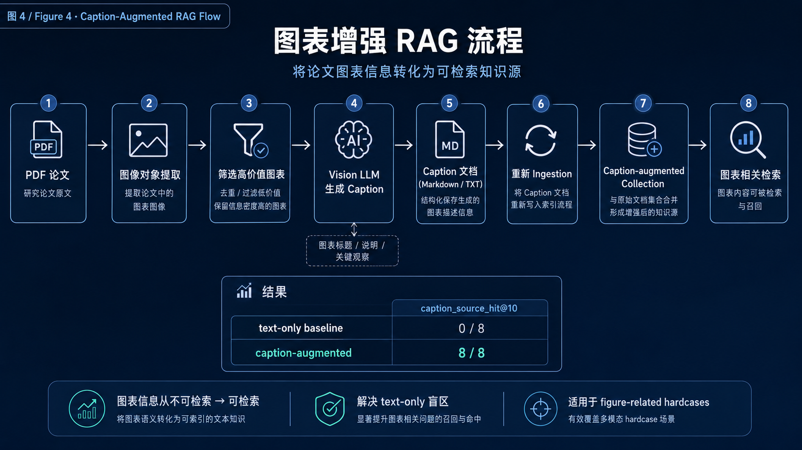
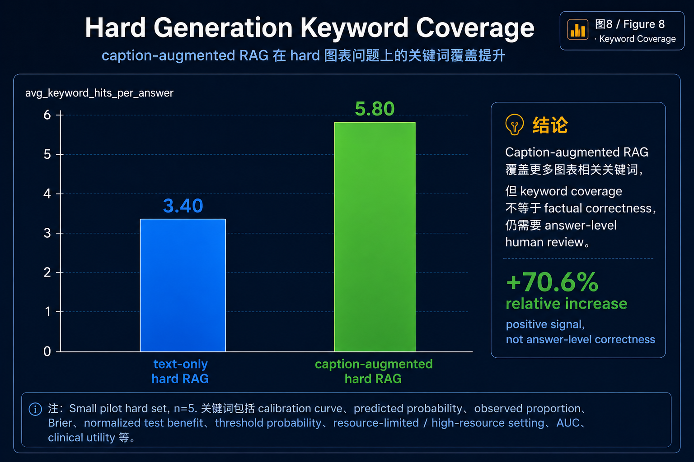

# Caption-Augmented RAG

本文档解释 figure-caption 增强实验。

## 1. Motivation

纯文本 RAG 可以回答许多论文级问题，但 figures 和 tables 通常包含重要证据：

- calibration curves
- Brier scores
- normalized test benefit curves
- resource-limited vs high-resource settings
- external validation plots

目标是将选定的图表信息转化为可检索的文本。

## 2. Pipeline

**Caption-Augmented RAG Pipeline**  

步骤：

1. 安装 PyMuPDF 并启用 image extraction
2. 重新 ingest Reti-Pioneer 论文
3. 提取 32 个 image objects
4. 筛选 8 张大图
5. 将图像缩放到可管理的宽度
6. 用 Vision LLM 生成中文 captions
7. 将 captions 保存为 Markdown
8. 将 Markdown 作为 derived text source 入库
9. 比较 text-only 和 caption-augmented 的 retrieval/generation 效果

## 3. Retrieval Result

Hard retrieval 结果：

| setting | source_hit_rate | source_mrr |
| --- | ---: | ---: |
| text-only hard | 0.0000 | 0.0000 |
| caption-augmented hard | 1.0000 | 0.2500 |

这表明 caption-derived knowledge 可以被可靠地检索用于 chart-focused questions。

## 4. Generation Result

Hard generation keyword coverage：

| setting | avg_keyword_hits_per_answer |
| --- | ---: |
| text-only hard | 3.40 |
| caption-augmented hard | 5.80 |

Generation 有提升，但仍需谨慎解释。Keyword coverage 不等于 answer-level factual correctness。

## 5. Reliability Boundary

Vision-generated captions 可能 misread dense medical figures。在本项目中，captions 被视为 model-assisted annotations，而非 final factual labels。

在使用 captions 作为 evidence 之前，后续步骤应包含：

- manual review
- answer-level correctness labels
- stricter chart-only golden questions

**Caption Retrieval Comparison**  

**Hard Generation Keyword Coverage**  
