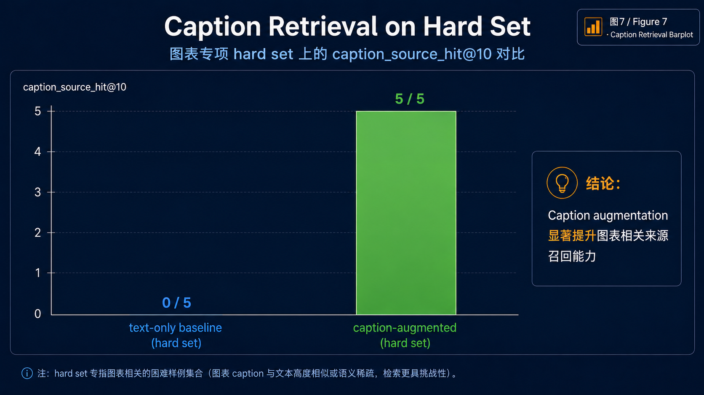

# Key Findings

本文档汇总眼科 RAG 评测项目的主要发现。

## 1. Dense Retrieval 优于简单 Hybrid RRF

检索 hard set 结果显示：

| mode | source_hit@5 | source_mrr@5 | avg_query_ms |
| --- | ---: | ---: | ---: |
| dense | 1.0000 | 0.7917 | 371.93 |
| hybrid | 0.9167 | 0.7667 | 703.43 |
| sparse | 0.8333 | 0.6944 | 223.81 |

主要原因在于跨语言检索：很多问题用中文撰写，而相关 sources 是英文论文。Dense retrieval 在这方面比 keyword matching 处理得更好。

## 2. 简单 Hybrid Search 可能被关键词噪声干扰

在 RETFound 案例中，sparse retrieval 将包含“基础模型”、“泛化”、“预训练”等通用词的中文汇报 chunks 排得过高。经过 RRF fusion 后，正确的英文论文被挤出了 top-5。

这是一个有用的警示：hybrid search 并不自动更好，仍然需要 weighted RRF、query rewrite 或 reranking。

## 3. RAG Generation Quality 取决于 Source Coverage

对于多源问题，当 retrieval 遗漏了部分 evidence chain 时，RAG 答案会变弱。答案可能仍然流畅，但无法完整覆盖多模态模型、报告生成和临床验证之间的关系。

## 4. LLM Ingestion Enhancement 应该是选择性的

全量 chunk-level LLM refinement 在长论文上导致大量 fallback：

| document | chunks | LLM refined | fallback |
| --- | ---: | ---: | ---: |
| 汇报6.pdf | 6 | 6 | 0 |
| Reti-Pioneer paper | 126 | 10 | 116 |

这提示了面向生产的设计方向：

- 先做稳定的 rule-based ingestion
- 异步 LLM refinement
- selective chunk selection
- caching
- retry with exponential backoff

## 5. Caption-Augmented RAG 有助于图表检索

在 hard vision caption set 上：

| setting | source_hit_rate | source_mrr |
| --- | ---: | ---: |
| text-only hard | 0.0000 | 0.0000 |
| caption-augmented hard | 1.0000 | 0.2500 |

Caption-augmented collection 可以可靠地检索 figure-caption-derived knowledge。

## 6. Generation 有提升，但仍需人工复核

Hard generation keyword coverage：

| setting | avg_keyword_hits_per_answer |
| --- | ---: |
| text-only hard | 3.40 |
| caption-augmented hard | 5.80 |

这是一个 positive signal，但 keyword coverage 不等于 factual correctness。下一步应进行 answer-level correctness review。

**Caption Retrieval Summary**  
